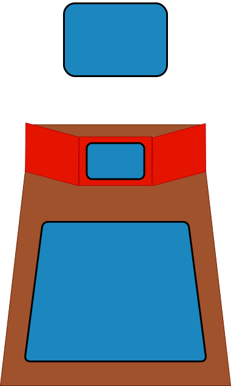

# Mechanus (WIP)

This project provides software for a local vttrpg / gaming setup, by managing multiple screens/clients/players/dm to help create a ttrpg experience using hardware, allowing a virtual table screen, scenery screens etc.

This project uses server driven UI, where the server written in [Go](https://go.dev/), The screen (or client) side is using [Pixi.js](https://pixijs.com/) for the rendering of the screens. While [connectRpc](https://connectrpc.com/) pins down the protocol between server and client. Each screen or client can connect and either login in as a viewer, device, player, or GM and either get their own screen rendered.

This allows the server and thus GM to control a TV screen on the table as battle map. Or TV or PC monitors to display scenery, maps or anything else. Intheory when also music and lightning is integrated, it will allow you to control the entire game room via browser.

## Contents

- [Documentation](./docs/README.md)
- [Local development?](./docs/development.md)
- [Want to contribute?](./docs/contributing.md)

## Tech Stack

### General tech stack

| Tech                                                      | Usage                                                                                               |
| --------------------------------------------------------- | --------------------------------------------------------------------------------------------------- |
| [Buf](https://github.com/bufbuild/buf)                    | The compiler used by connectRPC and proto to generate the necessary object and services             |
| [ConnectRPC](https://connectrpc.com/)                     | A collection of libraries and tools to setup grpc communication using proto3                        |
| [Go](https://go.dev/)                                     | The language used for the server stack                                                              |
| [Make](https://www.gnu.org/software/make/)                | A tool that can read and execute commands from a file, helping with local development               |
| [Nodejs](https://nodejs.org/en)                           | The stack enabling svelte and generation of browser code                                            |
| [Playwright](https://playwright.dev/)                     | The browser testing suite that powers the clients testing suite and the integration tests           |
| [Proto3](https://protobuf.dev/programming-guides/proto3/) | The protocol language used to connect the client <-> server                                         |
| [Vscode](https://code.visualstudio.com/)                  | The IDE that preferred to be used, all debugging and local development are configured around vscode |

### Client tech stack

| Tech                                    | Usage                                                        |
| --------------------------------------- | ------------------------------------------------------------ |
| [Eslint](https://eslint.org/)           | The linting tool used to check the code quality              |
| [Flowbite](https://flowbite.com/)       | Component library for svelte                                 |
| [Pixi.js](https://pixijs.com/)          | 2D rendering of screen                                       |
| [Prettier](https://prettier.io/)        | The code formatter that is used for all the client side code |
| [Svelte](https://svelte.dev/)           | Static site generation for the screen                        |
| [TailwindCSS](https://tailwindcss.com/) | The tool that makes css easier for components                |

### Server tech stack

| Tech                                                                                | Usage                                                                                    |
| ----------------------------------------------------------------------------------- | ---------------------------------------------------------------------------------------- |
| [Charm.sh](https://charm.land/) components                                          | Components for TUI applications, styling and logging                                     |
| [GolangCI lint](https://github.com/golangci/golangci-lint)                          | The linting tool used for the server, ensuring code quality                              |
| [Ginkgo](https://github.com/onsi/ginkgo) & [Gomega](https://github.com/onsi/gomega) | The testing framework used for unit and component tests                                  |
| [Cobra](https://github.com/spf13/cobra)                                             | The framework used for cli command handling, allowing us to build one binary for all     |
| [Viper](https://github.com/spf13/viper)                                             | The library / framework that used to build the configuration handling of the server      |
| [Gorm](gorm.io/gorm)                                                                | The library or ORM (object relation manager) used to connect golang object to SQL tables |
| [Golang Jwt](https://github.com/golang-jwt/jwt)                                     | The library used to make user authentication tokens                                      |
| [OpenTelemetry](https://opentelemetry.io/)                                          | Observability framework for distributed tracing and monitoring                           |

## TODO Features

- [x] Use https://connectrpc.com/docs/go/getting-started
- [ ] Manage the TV on the table for battle map displayment
- [ ] Player views
- [ ] DM views
- [ ] Support for other vttrpg file formats

