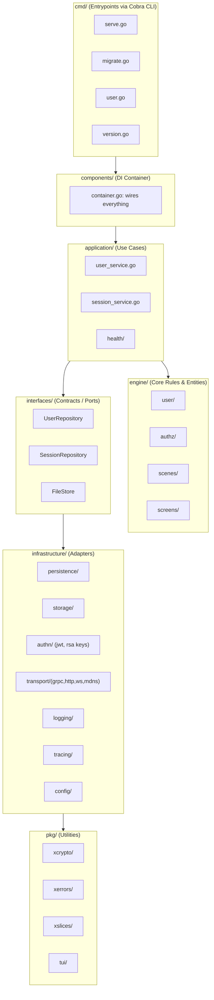

# Project structure

```mermaid
flowchart TD
    subgraph Engine["engine/ (Core Rules & Entities)"]
        U["user/"]
        A["authz/"]
        Scn["scenes/"]
        Scr["screens/"]
    end

    subgraph Application["application/ (Use Cases)"]
        US["user_service.go"]
        SS["session_service.go"]
        HC["health/"]
    end

    subgraph Interfaces["interfaces/ (Contracts / Ports)"]
        R1["UserRepository"]
        R2["SessionRepository"]
        FS["FileStore"]
    end

    subgraph Infrastructure["infrastructure/ (Adapters)"]
        PER["persistence/"]
        ST["storage/"]
        AUTHN["authn/ (jwt, rsa keys)"]
        T["transport/(grpc,http,ws,mdns)"]
        LG["logging/"]
        TR["tracing/"]
        CFG["config/"]
    end

    subgraph Components["components/ (DI Container)"]
        C["container.go: wires everything"]
    end

    subgraph Cmd["cmd/ (Entrypoints via Cobra CLI)"]
        S["serve.go"]
        M["migrate.go"]
        Uc["user.go"]
        V["version.go"]
    end

    subgraph Pkg["pkg/ (Utilities)"]
        X1["xcrypto/"]
        X2["xerrors/"]
        X3["xslices/"]
        X4["tui/"]
    end

    Cmd --> Components
    Components --> Application
    Application --> Engine
    Application --> Interfaces
    Interfaces --> Infrastructure
    Infrastructure --> Pkg
```
