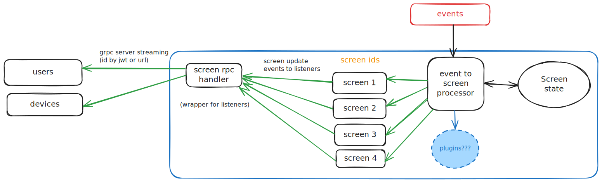

# Scene to Screen

This documents describes the process of scenes, and their events, being mapped to screens in the Mechanus server. (Which eventually will be send to listerning clients.)

Listening clients can be any users logged in with the role of `admin`, `operator`, `user` or `viewer`, optionally they can request to listen to specific screens.

## Flow

